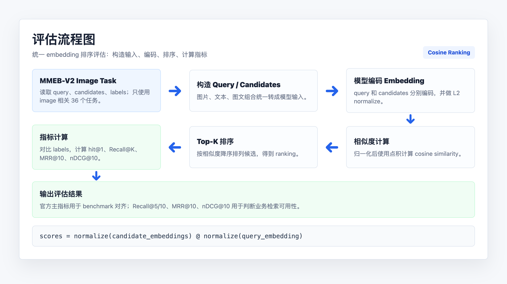
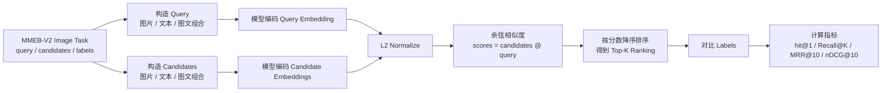
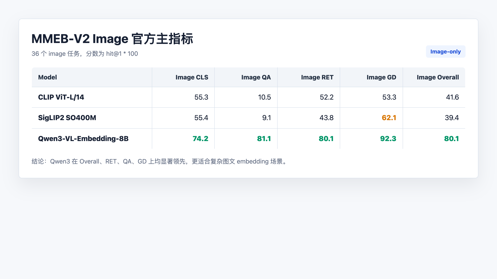
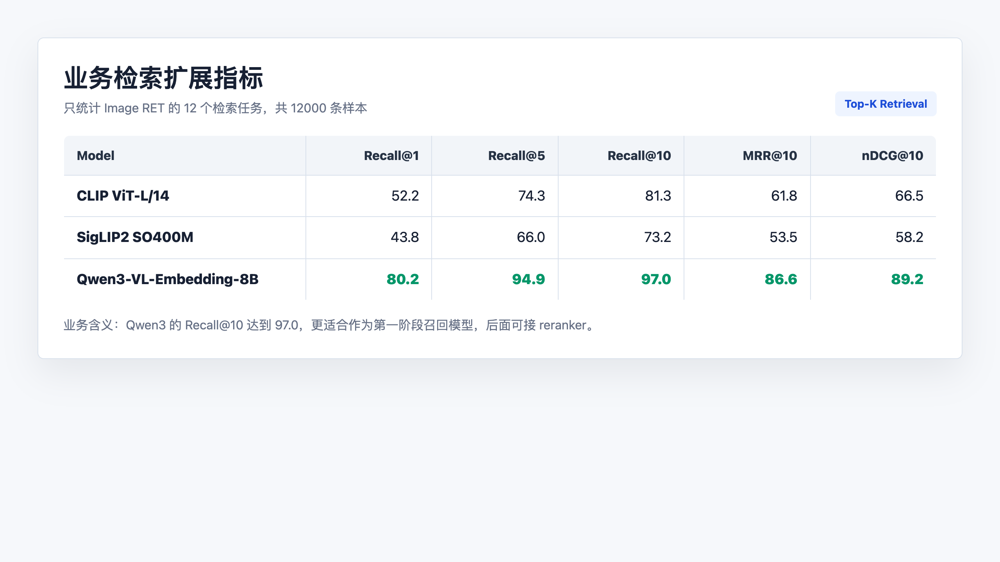
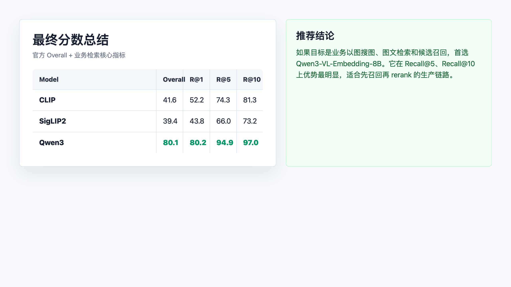

# MMEB-V2 Image 模型评估报告

生成时间：2026-05-28  
评估范围：仅评估 MMEB-V2 的 image 部分，不包含 video、visdoc 或纯文本 MMTEB。

## 1. 评估目标

本次评估对比以下三个多模态/图文 embedding 模型在 MMEB-V2 image-only 任务上的表现：

| Model | 模型来源 | 评估定位 |
|---|---|---|
| CLIP | `openai/clip-vit-large-patch14` | CLIP-like baseline |
| SigLIP2 | `google/siglip2-so400m-patch14-384` | CLIP-like baseline |
| Qwen3-VL-Embedding-8B | `Qwen/Qwen3-VL-Embedding-8B` | 官方 VLM embedding 模型 |

说明:
CLIP-like baseline: CLIP / SigLIP2 这类“双塔图文对齐模型”作为基础对照模型来评估,都是类似 CLIP 架构的模型

目标是得到与官方 MMEB-V2 image 表格一致的五个核心指标：

| 指标 | 含义 |
|---|---|
| Image CLS | 10 个图像分类任务均值 |
| Image QA | 10 个图像问答任务均值 |
| Image RET | 12 个图文/图像检索任务均值 |
| Image GD | 4 个 grounding 任务均值 |
| Image Overall | 36 个 image 任务总均值 |

所有分数均为 `hit@1 * 100`，保留一位小数。

同时，为了判断模型在业务以图搜图、图文检索中的真实可用性，额外补充 `Image RET` 的扩展检索指标：

| 指标 | 含义 | 业务意义 |
|---|---|---|
| Recall@1 | 正确结果排第 1 的比例 | 用户点开第一个结果即可命中的概率 |
| Recall@5 | 正确结果进入前 5 的比例 | 搜索首屏或少量候选中的可用性 |
| Recall@10 | 正确结果进入前 10 的比例 | 候选召回质量，适合后接 reranker |
| MRR@10 | 前 10 内正确结果排名倒数的均值 | 越靠前越高，反映排序体验 |
| nDCG@10 | 前 10 排序质量 | 对多个相关答案或排序位置更敏感 |

## 2. 数据来源

### 2.1 数据集

使用 MMEB-V2 image-only 数据。

| 项 | 内容 |
|---|---|
| 数据集主页 | `https://huggingface.co/datasets/TIGER-Lab/MMEB-V2/` |
| 评估元数据 | `ziyjiang/MMEB_Test_Instruct` |
| 本地图像数据目录 | `/root/autodl-tmp/mmeb_eval/data/image-tasks/MMEB` |
| 数据规模 | image 部分约 7.7GB，36 个任务目录 |

说明：

- 图像文件来自 MMEB-V2 image tasks。
- query/corpus/label 元数据通过 `datasets.load_dataset("ziyjiang/MMEB_Test_Instruct", task_name, split="test")` 加载。
- 只跑 image 配置，没有下载或评估 video / visdoc 全量数据。

### 2.2 任务分组

| 分组 | 任务数 | 任务 |
|---|---:|---|
| Image CLS | 10 | `ImageNet-1K`, `N24News`, `HatefulMemes`, `VOC2007`, `SUN397`, `Place365`, `ImageNet-A`, `ImageNet-R`, `ObjectNet`, `Country211` |
| Image QA | 10 | `OK-VQA`, `A-OKVQA`, `DocVQA`, `InfographicsVQA`, `ChartQA`, `Visual7W`, `ScienceQA`, `VizWiz`, `GQA`, `TextVQA` |
| Image RET | 12 | `MSCOCO_i2t`, `VisualNews_i2t`, `VisDial`, `MSCOCO_t2i`, `VisualNews_t2i`, `WebQA`, `EDIS`, `Wiki-SS-NQ`, `CIRR`, `NIGHTS`, `OVEN`, `FashionIQ` |
| Image GD | 4 | `MSCOCO`, `RefCOCO`, `RefCOCO-Matching`, `Visual7W-Pointing` |

## 3. 默认运行环境

| 项 | 内容 |
|---|---|
| GPU | NVIDIA RTX PRO 6000 Blackwell Server Edition，约 96GB 显存 |
| 工作目录 | `/root/autodl-tmp/mmeb_eval` |
| Python 环境 | `/root/miniconda3/bin/python` |
| 数据目录 | `/root/autodl-tmp/mmeb_eval/data/image-tasks/MMEB` |
| 模型目录 | `/root/autodl-tmp/mmeb_eval/models` |
| 输出目录 | `/root/autodl-tmp/mmeb_eval/results` |

## 4. 模型版本和路径

| Model | 模型 ID | 本地路径/输出目录 |
|---|---|---|
| CLIP | `openai/clip-vit-large-patch14` | `/root/autodl-tmp/mmeb_eval/results/clip-vit-large-patch14-image` |
| SigLIP2 | `google/siglip2-so400m-patch14-384` | `/root/autodl-tmp/mmeb_eval/results/siglip2-so400m-patch14-384-image` |
| Qwen3-VL-Embedding-8B | `Qwen/Qwen3-VL-Embedding-8B` | `/root/autodl-tmp/mmeb_eval/models/Qwen3-VL-Embedding-8B` |

Qwen3 官方仓库：

```text
/root/autodl-tmp/mmeb_eval/Qwen3-VL-Embedding
```

## 5. 评估逻辑和方式





### 5.1 总体评估逻辑

MMEB-V2 image 任务本质上是统一的 embedding 排序评估。每条样本包含一个 query、一组 candidate，以及一个或多个正确 label。评估流程如下：

1. 读取任务元数据：从 `ziyjiang/MMEB_Test_Instruct` 加载指定任务的 `test` split。
2. 构造 query：query 可能是图片、文本，或图片加文本的组合。
3. 构造 candidates：candidate 同样可能是图片、文本，或图片加文本的组合。
4. 编码向量：模型分别把 query 和 candidates 编码成 embedding。
5. 向量归一化：对 embedding 做 L2 normalize。
6. 相似度计算：使用余弦相似度，归一化后等价于向量点积。
7. 排序：按相似度从高到低得到 candidate ranking。
8. 计算指标：将 ranking 与 label 对比，计算 `hit@1`、`Recall@K`、`MRR@K`、`nDCG@K` 等指标。

核心伪代码：

```text
query_embedding = normalize(model.encode(query))
candidate_embeddings = normalize(model.encode(candidates))
scores = candidate_embeddings @ query_embedding
ranking = sort(candidates, by=scores, descending=True)
metrics = evaluate(ranking, labels)
```

指标计算逻辑：

| 指标 | 计算方式 | 解读 |
|---|---|---|
| hit@1 / Recall@1 | Top 1 是否包含正确 label | 第一个结果是否命中 |
| Recall@5 | Top 5 中正确 label 覆盖率 | 首屏候选是否包含正确结果 |
| Recall@10 | Top 10 中正确 label 覆盖率 | 召回阶段是否把正确结果捞上来 |
| MRR@10 | `1 / 正确结果排名`，只看前 10 | 正确结果越靠前越好 |
| nDCG@10 | 根据正确结果位置做折损累计 | 排序质量指标，越靠前越高 |

对于本次 `Image RET` 任务，大多数样本只有一个标准正确答案，因此 `hit@K` 和 `Recall@K` 数值一致或非常接近。

### 5.2 Qwen3-VL-Embedding-8B

Qwen3 使用官方仓库评估脚本：

```text
src.evaluation.mmeb_v2.eval_embedding
```

使用配置：

```text
scripts/evaluation/mmeb_v2/image.yaml
```

关键参数：

```bash
--normalize true
--per_device_eval_batch_size 8
--dataloader_num_workers 4
--model_name_or_path /root/autodl-tmp/mmeb_eval/models/Qwen3-VL-Embedding-8B
--dataset_config scripts/evaluation/mmeb_v2/image.yaml
--encode_output_path results/evaluation/mmeb_v2/Qwen3-VL-Embedding-8B/image
--data_basedir data/evaluation/mmeb_v2
```

环境调整：

- 使用 `bfloat16`。
- attention 从官方默认 `flash_attention_2` 改为 `sdpa`，避免额外安装 `flash-attn`。
- 使用 `HF_ENDPOINT=https://hf-mirror.com` 加载评估元数据。

最终输出：

```text
/root/autodl-tmp/mmeb_eval/Qwen3-VL-Embedding/results/evaluation/mmeb_v2/Qwen3-VL-Embedding-8B/summary.tsv
/root/autodl-tmp/mmeb_eval/Qwen3-VL-Embedding/results/evaluation/mmeb_v2/Qwen3-VL-Embedding-8B/details.tsv
```

### 5.3 CLIP 和 SigLIP2

CLIP/SigLIP2 没有使用 Qwen 官方 embedder 直接跑，因为模型接口不同：

- Qwen3 是 VLM embedding 模型，支持图文混合输入和 instruction。
- CLIP/SigLIP2 是双塔模型，分别编码 image/text。

因此使用 CLIP-like baseline 适配脚本：

```text
/root/autodl-tmp/mmeb_eval/VLM2Vec/eval_clip_siglip_image.py
```

适配逻辑：

- image-only 输入：使用 image encoder。
- text-only 输入：使用 text encoder。
- image + text 混合输入：分别得到 image/text embedding，取平均后再 L2 normalize。
- 计算 query 与 candidate 的余弦相似度，按相似度排序。
- 每个任务输出 `*_score.json` 和 `*_pred.jsonl`。
- 最终按 36 个任务的 `hit@1` 重新分组汇总。

重要修正：

- SigLIP2 text processor 使用 `padding="max_length"`，否则部分分类任务会异常低。
- `image_i2i_vg` 任务的 candidate ID 使用 `image_path:text`，避免仅使用 image path 导致重复 ID，尤其影响 `RefCOCO-Matching`。
- 旧的 `ndcg@10` 汇总不用于最终对齐官方表格；最终使用 `hit@1`。

## 6. 汇总结果

### 6.1 官方 MMEB-V2 image 主指标



| Model | Image CLS | Image QA | Image RET | Image GD | Image Overall |
|---|---:|---:|---:|---:|---:|
| CLIP `openai/clip-vit-large-patch14` | 55.3 | 10.5 | 52.2 | 53.3 | 41.6 |
| SigLIP2 `google/siglip2-so400m-patch14-384` | 55.4 | 9.1 | 43.8 | 62.1 | 39.4 |
| Qwen3-VL-Embedding-8B | 74.2 | 81.1 | 80.1 | 92.3 | 80.1 |

### 6.2 业务检索扩展指标



以下结果只统计 `Image RET` 的 12 个检索任务，每个任务 1000 条样本，共 12000 条。分数均为百分制。

| Model | Recall@1 | Recall@5 | Recall@10 | MRR@10 | nDCG@10 |
|---|---:|---:|---:|---:|---:|
| CLIP `openai/clip-vit-large-patch14` | 52.2 | 74.3 | 81.3 | 61.8 | 66.5 |
| SigLIP2 `google/siglip2-so400m-patch14-384` | 43.8 | 66.0 | 73.2 | 53.5 | 58.2 |
| Qwen3-VL-Embedding-8B | 80.2 | 94.9 | 97.0 | 86.6 | 89.2 |

说明：

- `Recall@1` 与官方 `Image RET` 的 `hit@1` 基本等价。
- `Recall@5/10` 更接近业务中的候选召回能力。
- `MRR@10` 更接近用户体验，因为第 1 名命中和第 10 名命中差别很大。
- Qwen3 官方脚本输出的是 `ndcg_linear@10` / `ndcg_exponential@10`；本次 RET 任务相关性为二值时二者相同，报告中统一记为 `nDCG@10`。

### 6.3 Image RET 逐任务扩展指标

| Model | Dataset | Recall@1 | Recall@5 | Recall@10 | MRR@10 | nDCG@10 |
|---|---|---:|---:|---:|---:|---:|
| CLIP | MSCOCO_i2t | 57.0 | 83.2 | 90.7 | 68.4 | 73.8 |
| CLIP | VisualNews_i2t | 80.3 | 91.1 | 93.6 | 85.1 | 87.2 |
| CLIP | VisDial | 30.6 | 56.6 | 71.3 | 42.1 | 49.0 |
| CLIP | MSCOCO_t2i | 60.6 | 84.6 | 92.2 | 71.1 | 76.2 |
| CLIP | VisualNews_t2i | 79.0 | 91.2 | 93.3 | 84.5 | 86.7 |
| CLIP | WebQA | 68.0 | 85.1 | 89.0 | 75.5 | 78.8 |
| CLIP | EDIS | 76.9 | 93.2 | 97.4 | 84.1 | 87.4 |
| CLIP | Wiki-SS-NQ | 54.7 | 74.0 | 79.4 | 63.0 | 67.0 |
| CLIP | CIRR | 13.3 | 50.4 | 66.4 | 29.5 | 38.3 |
| CLIP | NIGHTS | 60.2 | 92.6 | 95.1 | 74.3 | 79.5 |
| CLIP | OVEN | 31.3 | 55.5 | 64.1 | 41.7 | 47.1 |
| CLIP | FashionIQ | 14.2 | 33.6 | 42.5 | 22.3 | 27.1 |
| SigLIP2 | MSCOCO_i2t | 66.1 | 88.8 | 94.6 | 75.9 | 80.4 |
| SigLIP2 | VisualNews_i2t | 50.1 | 66.9 | 71.3 | 57.1 | 60.6 |
| SigLIP2 | VisDial | 22.2 | 42.1 | 54.3 | 30.8 | 36.3 |
| SigLIP2 | MSCOCO_t2i | 70.6 | 92.4 | 95.5 | 80.1 | 83.9 |
| SigLIP2 | VisualNews_t2i | 46.4 | 61.9 | 67.2 | 53.3 | 56.6 |
| SigLIP2 | WebQA | 25.3 | 44.8 | 51.3 | 33.3 | 37.6 |
| SigLIP2 | EDIS | 28.1 | 47.7 | 57.8 | 36.8 | 41.8 |
| SigLIP2 | Wiki-SS-NQ | 68.8 | 85.5 | 89.4 | 76.1 | 79.4 |
| SigLIP2 | CIRR | 14.6 | 55.9 | 70.7 | 32.0 | 41.3 |
| SigLIP2 | NIGHTS | 63.4 | 95.5 | 97.9 | 77.6 | 82.7 |
| SigLIP2 | OVEN | 53.0 | 72.2 | 79.3 | 61.6 | 65.8 |
| SigLIP2 | FashionIQ | 17.4 | 38.8 | 49.6 | 27.0 | 32.4 |
| Qwen3 | MSCOCO_i2t | 79.1 | 96.3 | 98.5 | 86.6 | 89.6 |
| Qwen3 | VisualNews_i2t | 85.3 | 94.7 | 96.3 | 89.4 | 91.1 |
| Qwen3 | VisDial | 87.3 | 98.0 | 99.2 | 91.9 | 93.7 |
| Qwen3 | MSCOCO_t2i | 81.1 | 97.3 | 98.8 | 88.2 | 90.8 |
| Qwen3 | VisualNews_t2i | 81.7 | 93.8 | 95.5 | 87.0 | 89.1 |
| Qwen3 | WebQA | 91.7 | 99.0 | 99.6 | 95.1 | 96.3 |
| Qwen3 | EDIS | 96.3 | 100.0 | 100.0 | 97.9 | 98.4 |
| Qwen3 | Wiki-SS-NQ | 88.0 | 97.4 | 98.1 | 92.1 | 93.6 |
| Qwen3 | CIRR | 75.0 | 95.9 | 98.2 | 83.8 | 87.4 |
| Qwen3 | NIGHTS | 73.2 | 99.0 | 99.9 | 84.4 | 88.3 |
| Qwen3 | OVEN | 79.0 | 95.7 | 97.9 | 86.2 | 89.1 |
| Qwen3 | FashionIQ | 44.1 | 71.7 | 82.2 | 56.2 | 62.5 |

## 7. 业务可用性结论

| 场景 | 最推荐模型 | 依据 |
|---|---|---|
| 图文检索，直接展示 Top 1 | Qwen3-VL-Embedding-8B | `Recall@1 = 80.2`，显著高于 CLIP 的 52.2 和 SigLIP2 的 43.8 |
| 图文检索，展示 Top 5 | Qwen3-VL-Embedding-8B | `Recall@5 = 94.9`，首屏候选基本可用 |
| 图文检索，先召回再 rerank | Qwen3-VL-Embedding-8B | `Recall@10 = 97.0`，适合作为第一阶段召回模型 |
| 轻量级 baseline / 成本敏感 | CLIP | 整体检索优于本次 SigLIP2，部署成本低于 Qwen3 |
| 局部以图搜图 / 图像相似检索 | 需结合私有数据复测 | MMEB-V2 的 RET 含 text-image、image-text、image-image/multimodal retrieval，不能完全等同你的业务图片库 |

业务判断：

- 如果线上目标是“用户输入图片或文本，返回最相关图片/内容”，优先选择 Qwen3-VL-Embedding-8B。
- 如果资源有限，只能上轻量模型，CLIP 比本次 SigLIP2 更稳，尤其是 `Image RET` 平均和 `MRR@10`。
- SigLIP2 在个别任务如 `MSCOCO_t2i`、`NIGHTS`、`OVEN` 表现不错，但整体稳定性不如 CLIP。
- 如果业务面向中文图文检索，仍建议补一套中文私有验证集；MMEB-V2 image 任务主要不是中文业务语料，不能完全代表中文商品、票据、海报、截图等场景。

## 8. Qwen3 逐任务结果

| Group | Dataset | hit@1 |
|---|---|---:|
| Image CLS | ImageNet-1K | 82.1 |
| Image CLS | N24News | 80.8 |
| Image CLS | HatefulMemes | 77.0 |
| Image CLS | VOC2007 | 93.4 |
| Image CLS | SUN397 | 82.3 |
| Image CLS | Place365 | 47.9 |
| Image CLS | ImageNet-A | 76.8 |
| Image CLS | ImageNet-R | 93.9 |
| Image CLS | ObjectNet | 80.4 |
| Image CLS | Country211 | 27.2 |
| Image QA | OK-VQA | 77.5 |
| Image QA | A-OKVQA | 73.2 |
| Image QA | DocVQA | 96.3 |
| Image QA | InfographicsVQA | 88.2 |
| Image QA | ChartQA | 74.3 |
| Image QA | Visual7W | 70.9 |
| Image QA | ScienceQA | 81.2 |
| Image QA | VizWiz | 64.8 |
| Image QA | GQA | 92.4 |
| Image QA | TextVQA | 92.5 |
| Image RET | MSCOCO_i2t | 79.1 |
| Image RET | VisualNews_i2t | 85.3 |
| Image RET | VisDial | 87.3 |
| Image RET | MSCOCO_t2i | 81.1 |
| Image RET | VisualNews_t2i | 81.7 |
| Image RET | WebQA | 91.7 |
| Image RET | EDIS | 96.3 |
| Image RET | Wiki-SS-NQ | 88.0 |
| Image RET | CIRR | 75.0 |
| Image RET | NIGHTS | 73.2 |
| Image RET | OVEN | 79.0 |
| Image RET | FashionIQ | 44.1 |
| Image GD | MSCOCO | 86.3 |
| Image GD | RefCOCO | 95.8 |
| Image GD | RefCOCO-Matching | 91.1 |
| Image GD | Visual7W-Pointing | 96.0 |

## 9. 结果解读

### 9.1 Qwen3 显著领先

Qwen3-VL-Embedding-8B 的 `Image Overall = 80.1`，显著高于 CLIP 的 `41.6` 和 SigLIP2 的 `39.4`。

主要优势来自：

- Image QA：Qwen3 为 81.1，CLIP/SigLIP2 只有 10.5 / 9.1。
- Image GD：Qwen3 为 92.3，CLIP/SigLIP2 为 53.3 / 62.1。
- Image RET：Qwen3 为 80.1，CLIP/SigLIP2 为 52.2 / 43.8。

这说明 Qwen3-VL-Embedding-8B 对 instruction、图文混合输入和复杂多模态检索更友好。

### 9.2 CLIP/SigLIP2 在 QA 上不占优

CLIP/SigLIP2 是双塔图文对齐模型，并不是面向 visual question answering embedding 任务训练的模型。  
因此在 `Image QA` 上分数较低是预期现象。

### 9.3 SigLIP2 的 Image GD 高于 CLIP

SigLIP2 在 `Image GD` 上为 62.1，高于 CLIP 的 53.3。  
这说明 SigLIP2 在部分 image-to-image / grounding-like retrieval 上更强，但其 `Image RET` 和 `Image Overall` 仍低于 CLIP。

## 10. 和官方结果的关系

Qwen3-VL-Embedding-8B 本次跑出的：

```text
Image Overall = 80.1
```

与官方公布的 MMEB-V2 image overall 结果对齐。  
各子项可能存在 0.1 到 0.3 的小差异，主要来源包括：

- `sdpa` 与 `flash_attention_2` attention 实现差异。
- `torch` / `transformers` / `datasets` / image processor 版本差异。
- `bfloat16` / `float16` 精度差异。
- 官方表格四舍五入方式。

当前差异属于正常范围。

## 11. 重要注意事项

1. CLIP/SigLIP2 与 Qwen3 的模型接口不同，所以不应说它们使用了完全相同的 Qwen 官方 embedder 脚本。
2. 但三者使用了相同的 MMEB-V2 image 任务、相同的 `hit@1` 汇总口径，因此可以放在同一张 MMEB-V2 image 对比表中。
3. CLIP/SigLIP2 的最终结果以 36 个 `*_score.json` 重新按官方分组计算得到，不依赖中间 `summary.json`。
4. 若 Hugging Face 元数据下载不稳定，可使用 `HF_ENDPOINT=https://hf-mirror.com` 后续跑未完成任务。

## 12. 复现命令摘要

完整脚本已放在：

```text
docs/evaluation-scripts/
```

从零复现的详细操作手册见：

```text
docs/evaluation-scripts/MMEB_V2_IMAGE_REPRODUCE_GUIDE.md
```

其中 `eval_clip_siglip_image.py` 是 CLIP/SigLIP2 的实际评估脚本，`run_mmeb_v2_image_eval.sh` 是统一运行入口，`summarize_mmeb_v2_image_results.py` 用于汇总官方指标和业务检索扩展指标。

Qwen3 的官方评估入口文件也已摘录到：

```text
docs/evaluation-scripts/qwen3-official/
```

其中包含：

```text
qwen3-official/src/evaluation/mmeb_v2/eval_embedding.py
qwen3-official/src/evaluation/mmeb_v2/gather_results.py
qwen3-official/scripts/evaluation/mmeb_v2/image.yaml
qwen3-official/scripts/evaluation/mmeb_v2/eval_embedding.sh
```

注意：`results/evaluation/mmeb_v2` 是 Qwen3 官方仓库内的相对输出目录，不是外部下载地址。完整结果路径为：

```text
/root/autodl-tmp/mmeb_eval/Qwen3-VL-Embedding/results/evaluation/mmeb_v2/Qwen3-VL-Embedding-8B
```

### 12.1 Qwen3

```bash
cd /root/autodl-tmp/mmeb_eval/Qwen3-VL-Embedding

HF_ENDPOINT=https://hf-mirror.com \
HF_HOME=/root/autodl-tmp/mmeb_eval/cache \
TRANSFORMERS_CACHE=/root/autodl-tmp/mmeb_eval/cache \
CUDA_VISIBLE_DEVICES=0 \
/root/miniconda3/bin/python -m src.evaluation.mmeb_v2.eval_embedding \
  --normalize true \
  --per_device_eval_batch_size 8 \
  --dataloader_num_workers 4 \
  --model_name_or_path /root/autodl-tmp/mmeb_eval/models/Qwen3-VL-Embedding-8B \
  --dataset_config scripts/evaluation/mmeb_v2/image.yaml \
  --encode_output_path results/evaluation/mmeb_v2/Qwen3-VL-Embedding-8B/image \
  --data_basedir data/evaluation/mmeb_v2 \
  --output_dir /root/autodl-tmp/mmeb_eval/qwen_eval_tmp
```

汇总：

```bash
/root/miniconda3/bin/python -m src.evaluation.mmeb_v2.gather_results \
  results/evaluation/mmeb_v2/Qwen3-VL-Embedding-8B \
  --output_dir results/evaluation/mmeb_v2/Qwen3-VL-Embedding-8B
```

### 12.2 CLIP

```bash
cd /root/autodl-tmp/mmeb_eval/VLM2Vec

/root/miniconda3/bin/python eval_clip_siglip_image.py \
  --model-id openai/clip-vit-large-patch14 \
  --kind clip \
  --dataset-config experiments/public/eval/image.yaml \
  --image-root /root/autodl-tmp/mmeb_eval/data/image-tasks/MMEB \
  --output-dir /root/autodl-tmp/mmeb_eval/results/clip-vit-large-patch14-image
```

### 12.3 SigLIP2

```bash
cd /root/autodl-tmp/mmeb_eval/VLM2Vec

/root/miniconda3/bin/python eval_clip_siglip_image.py \
  --model-id google/siglip2-so400m-patch14-384 \
  --kind siglip \
  --dataset-config experiments/public/eval/image.yaml \
  --image-root /root/autodl-tmp/mmeb_eval/data/image-tasks/MMEB \
  --output-dir /root/autodl-tmp/mmeb_eval/results/siglip2-so400m-patch14-384-image
```

## 13. 最终分数总结



| Model | Image Overall | Image RET Recall@1 | Image RET Recall@5 | Image RET Recall@10 | Image RET MRR@10 | Image RET nDCG@10 | 业务建议 |
|---|---:|---:|---:|---:|---:|---:|---|
| CLIP `openai/clip-vit-large-patch14` | 41.6 | 52.2 | 74.3 | 81.3 | 61.8 | 66.5 | 轻量 baseline，可用于成本敏感场景 |
| SigLIP2 `google/siglip2-so400m-patch14-384` | 39.4 | 43.8 | 66.0 | 73.2 | 53.5 | 58.2 | 本次整体不如 CLIP，除非私有数据复测更优 |
| Qwen3-VL-Embedding-8B | 80.1 | 80.2 | 94.9 | 97.0 | 86.6 | 89.2 | 首选，用于业务图文检索和候选召回 |

## 14. 业务可用性结论

在 MMEB-V2 image-only 评估中，Qwen3-VL-Embedding-8B 明显优于 CLIP 和 SigLIP2，最终 `Image Overall = 80.1`，与官方公布结果对齐。  
CLIP/SigLIP2 可作为图文双塔 baseline，但由于不支持 Qwen3 式 instruction-aware 多模态输入，在 Image QA、Image RET 和 Image GD 上与 Qwen3 存在显著差距。
